<div align="center">


# GNX Content Intelligence System

### **The platform for autonomous content creation.**

_Transform expertise into influence. AI-native multi-agent system for thought leaders who refuse to compromise on quality._

[](https://github.com/kbhat97/GNX-CIS)
[](https://github.com/kbhat97/GNX-CIS)
[](https://cloud.google.com)
[](https://www.python.org/)

[**Documentation**](docs/SYSTEM_ARCHITECTURE.md) • [**Features**](#-why-gnx-cis) • [**Quick Start**](#-quick-start) • [**Architecture**](#-architecture)

</div>

---

## 🎯 What is GNX CIS?

**GNX CIS** is an enterprise-grade, AI-native platform that deploys **coordinated teams of specialized agents** to transform ideas into high-impact LinkedIn content. Unlike single-model AI tools, CIS orchestrates multiple AI agents—each an expert in their domain—to create, evaluate, refine, and publish content that resonates.

### **The Problem We Solve**

Thought leaders face an impossible choice:

- **Spend hours** crafting content manually → Quality, but no scalability
- **Use AI assistants** (ChatGPT, Claude) → Fast, but generic and forgettable
- **Hire content agencies** → Expensive, slow, and loses your authentic voice

**GNX CIS eliminates this tradeoff.**

### **Our Solution: Multi-Agent Intelligence**

```python
# Traditional AI: One model, one shot
response = chatgpt.generate("Write a LinkedIn post about AI")
# → Generic, needs heavy editing, loses your voice

# GNX CIS: Orchestrated agent team
post = cis.generate(
    topic="AI in healthcare",
    user_context="15 years in medical tech, audience = C-suite executives"
)
# → Psychologically optimized, scored 87/100, on-brand, ready to publish
```

---

## 🚀 Why GNX CIS?

### **Not One AI. A Team.**

| Traditional AI Tools            | GNX CIS Multi-Agent System                    |
| ------------------------------- | --------------------------------------------- |
| ❌ Single model does everything | ✅ **6 specialized agents** collaborate       |
| ❌ Generic outputs              | ✅ **Personalized** to your voice & audience  |
| ❌ No quality control           | ✅ **Automatic scoring** & refinement (0-100) |
| ❌ Repetitive content           | ✅ **Learning engine** avoids patterns        |
| ❌ Manual publishing            | ✅ **One-click** LinkedIn publishing          |
| ❌ No analytics                 | ✅ **Performance tracking** & insights        |

### **Enterprise-Grade Foundation**

```
✅ Multi-Agent Orchestration    → Not one AI, but a coordinated team
✅ Psychological Hook Library   → 15+ proven engagement patterns
✅ Unbiased Quality Scoring     → Separate scorer eliminates self-evaluation bias
✅ Automatic Improvement Loops  → Content refined until it hits thresholds
✅ Learning from History        → Analyzes your successful posts
✅ Enterprise Security          → JWT auth + Row-Level Security (RLS)
✅ Production-Ready             → Auto-scaling on Google Cloud Run
✅ Subscription Management      → Stripe integration with 30-day trials
```

---

## 🤖 Meet the Agent Team

Each agent is a specialized AI with a single responsibility, powered by Google Gemini 2.0 Flash:

<table>
<tr>
<td width="50%">

### 🎯 **Content Architect**

**Role:** Primary content creator  
**Capabilities:**

- Analyzes your industry, audience, and voice profile
- Applies psychological hooks (FOMO, Authority, Pattern Interrupt)
- Generates posts in 8+ styles (Story, Data-Driven, How-To, etc.)
- Uses hook history to avoid repetition
- Integrates persona data for consistent brand voice

</td>
<td width="50%">

### 📊 **Virality Scorer**

**Role:** Unbiased quality evaluator  
**Capabilities:**

- Scores content 0-100 based on virality potential
- Evaluates hook strength, readability, emotional resonance
- Provides actionable improvement suggestions
- Prevents LLM self-evaluation bias
- Triggers improvement loops for low scores

</td>
</tr>
<tr>
<td>

### 📚 **History Analyst**

**Role:** Learning engine  
**Capabilities:**

- Fetches your post history from database
- Identifies successful patterns and hooks
- Provides personalized writing insights
- Feeds context to Content Architect
- Tracks performance metrics over time

</td>
<td>

### 🔄 **Reflector**

**Role:** Content improvement specialist  
**Capabilities:**

- Analyzes underperforming content
- Suggests specific improvements
- Re-writes posts based on feedback
- Iterative refinement until quality threshold met
- Maintains voice consistency across revisions

</td>
</tr>
<tr>
<td>

### 📤 **Publisher**

**Role:** LinkedIn automation  
**Capabilities:**

- Posts directly to LinkedIn via API
- Handles OAuth token management
- Uploads images with posts
- Error handling and retries
- Tracks published post metrics

</td>
<td>

### 💬 **Engagement Manager**

**Role:** Response automation  
**Capabilities:**

- Generates contextual comment replies
- Maintains brand voice in responses
- Suggests engagement strategies
- Analyzes comment sentiment
- Recommends follow-up actions

</td>
</tr>
</table>

---

## ⚡ How It Works

### **From Idea to Published Post in 10 Seconds**

```mermaid
graph LR
    A[User Input:<br/>Topic + Style] --> B[History Analyst]
    B --> C[Content Architect]
    C --> D[Virality Scorer]
    D --> E{Score ≥ 85?}
    E -->|No| F[Reflector Agent]
    F --> C
    E -->|Yes| G[Image Generator]
    G --> H[Save to Database]
    H --> I[User Review]
    I --> J{Publish?}
    J -->|Yes| K[Publisher Agent]
    K --> L[LinkedIn Post]
```



### **Example Workflow**

```python
# 1. User submits topic
input = {
    "topic": "How AI is transforming supply chain logistics",
    "style": "Data-Driven",
    "generate_image": True
}

# 2. History Analyst provides context
context = history_agent.analyze(user_id)
# → "User's successful posts use Authority hook, C-suite audience"

# 3. Content Architect generates post
draft = content_agent.generate(input, context)
# → "🚨 Supply chain leaders: AI reduced logistics costs by 34%..."

# 4. Virality Scorer evaluates
score = virality_agent.score(draft)
# → 87/100, "Strong hook, clear data, good CTA"

# 5. Image Generator creates visual
image = image_generator.create(draft.headline)
# → AI-generated infographic

# 6. Publisher posts to LinkedIn (if requested)
linkedin_id = publisher_agent.publish(draft, image)
# → Posted. Tracking engagement.
```

**Total Time:** ~8-12 seconds  
**User Effort:** 1 input field  
**Output Quality:** 85-95/100 virality score

---

## 🏗️ Architecture

### **High-Level System Design**

```
┌──────────────────────────────────────────────────────────────────┐
│                    FRONTEND (Glassmorphic SPA)                   │
│         Onboarding • Generate • History • Settings               │
└─────────────────────────┬────────────────────────────────────────┘
                          │ HTTPS (Clerk JWT Auth)
┌─────────────────────────▼────────────────────────────────────────┐
│               FASTAPI ORCHESTRATOR (Python 3.13)                 │
│    Rate Limiting • Multi-Agent Coordination • Payments           │
└─────────────────────────┬────────────────────────────────────────┘
                          │
        ┌─────────────────┼─────────────────┐
        │                 │                 │
┌───────▼──────┐  ┌───────▼────────┐  ┌────▼─────┐
│  AGENT TEAM  │  │   SUPABASE     │  │  STRIPE  │
│  • Content   │  │   PostgreSQL   │  │ Payments │
│  • Virality  │  │   + RLS        │  │ Webhooks │
│  • History   │  └────────────────┘  └──────────┘
│  • Reflector │
│  • Publisher │
│  • Engagement│
└───────┬──────┘
        │
┌───────▼──────────────────────────────────────────┐
│         GOOGLE AI PLATFORM                       │
│  Gemini 2.0 Flash • Imagen API • Embeddings      │
└──────────────────────────────────────────────────┘
```

### **Tech Stack**

| Layer          | Technology              | Purpose                                   |
| -------------- | ----------------------- | ----------------------------------------- |
| **Frontend**   | HTML/CSS/JS             | Glassmorphic UI, real-time updates        |
| **Backend**    | FastAPI (Python 3.13)   | API orchestration, agent coordination     |
| **Agents**     | Google Gemini 2.0 Flash | Content generation, scoring, analysis     |
| **Database**   | Supabase (PostgreSQL)   | User data, posts, analytics (RLS enabled) |
| **Auth**       | Clerk                   | Enterprise SSO, JWT validation            |
| **Payments**   | Stripe                  | Subscriptions, webhooks, trials           |
| **Images**     | Google Imagen API       | AI visual generation                      |
| **Deployment** | Google Cloud Run        | Auto-scaling, 0→100 instances             |
| **CI/CD**      | Cloud Build             | Automated testing, deployment             |
| **Secrets**    | GCP Secret Manager      | Production credentials                    |
| **Monitoring** | Cloud Logging           | Observability, debugging                  |

---

## 📦 Quick Start

### **Prerequisites**

- Python 3.13+
- Google Cloud Project (for AI APIs)
- Supabase account (PostgreSQL database)
- Clerk account (authentication)
- Stripe account (payments, optional for local dev)

### **Installation**

```bash
# Clone the repository
git clone https://github.com/kbhat97/GNX-CIS.git
cd GNX-CIS

# Install dependencies
pip install -r requirements.txt

# Configure environment
cp .env.example .env
# Edit .env with your API keys

# Run database migrations
# Apply SQL scripts in database/migrations/

# Start development server
uvicorn main:app --reload --host 0.0.0.0 --port 8000
```

### **Environment Setup**

```bash
# .env configuration (see .env.example for full list)

# Authentication
CLERK_SECRET_KEY=sk_test_...
CLERK_PUBLISHABLE_KEY=pk_test_...

# Database
SUPABASE_URL=https://...supabase.co
SUPABASE_SERVICE_KEY=eyJ...

# AI Engine
GOOGLE_API_KEY=AIza...

# Payments (optional for local dev)
STRIPE_SECRET_KEY=sk_live_...
```

**Production Note:** All secrets are managed via GCP Secret Manager in production deployments.

### **Development Workflow**

```bash
# Run the application
uvicorn main:app --reload

# Access dashboard
open http://localhost:8000

# Run tests
pytest tests/ -v

# Code quality checks
ruff check .
mypy main.py
```

---

## 💳 Pricing & Plans

| Plan         | Price      | Post Limit      | Features                                  |
| ------------ | ---------- | --------------- | ----------------------------------------- |
| **Free**     | $0/mo      | 5 posts/month   | Basic generation, 1 user                  |
| **Pro**      | $49.99/mo  | 30 posts/month  | All features, analytics, priority support |
| **Business** | $199.99/mo | 200 posts/month | Team access, API access, white-label      |

**All paid plans include:**

- ✅ 30-day free trial (no credit card required)
- ✅ Unlimited edits & improvements
- ✅ AI image generation
- ✅ LinkedIn auto-publishing
- ✅ Performance analytics
- ✅ Hook history & learning engine

---

## 📚 Documentation

Comprehensive documentation is available in the `/docs` folder:

| Document                                                            | Description                                       |
| ------------------------------------------------------------------- | ------------------------------------------------- |
| **[SYSTEM_ARCHITECTURE.md](docs/SYSTEM_ARCHITECTURE.md)**           | Complete system design, data flows, user journeys |
| **[stripe_secrets_migration.md](docs/stripe_secrets_migration.md)** | Secret Manager integration guide                  |
| **[PRE_COMMIT_REPORT.md](docs/PRE_COMMIT_REPORT.md)**               | Code quality checks and validations               |

### **Key API Endpoints**

```
POST   /api/generate              # Generate new post
GET    /api/posts                 # Fetch user's post history
POST   /api/improve/{post_id}     # Improve existing post
POST   /api/publish/{post_id}     # Publish to LinkedIn
POST   /api/create-checkout       # Create Stripe subscription
POST   /webhook/stripe            # Handle Stripe webhooks
GET    /health                    # System health check
```

For full API documentation, see [API Reference](docs/API.md).

---

## 🔐 Security & Compliance

### **Multi-Layer Security**

```
Layer 1: Clerk JWT Authentication (RS256)
         ↓
Layer 2: Supabase Row-Level Security (RLS)
         ↓
Layer 3: Rate Limiting (10 posts/hour per user)
         ↓
Layer 4: GCP Secret Manager (production secrets)
         ↓
Layer 5: Cloud Armor (DDoS protection)
```

### **Data Privacy**

- ✅ **Encryption at rest**: All user data encrypted in Supabase
- ✅ **Encryption in transit**: HTTPS/TLS 1.3 for all connections
- ✅ **Data isolation**: RLS ensures users only see their own data
- ✅ **Secret management**: No secrets in codebase, GCP Secret Manager only
- ✅ **Audit logs**: All admin access logged and tracked
- ✅ **GDPR ready**: User data export and deletion available

---

## 🚀 Deployment

### **Production Deployment (Google Cloud)**

```bash
# Trigger Cloud Build pipeline
git push origin master

# Automated pipeline:
# ✅ Build Docker images (API + Frontend)
# ✅ Run test suite
# ✅ Deploy to Cloud Run (auto-scaling)
# ✅ Inject secrets from Secret Manager
# ✅ Send Slack/Email notifications
# ✅ Health check validation
```

### **Cloud Run Configuration**

```yaml
Service: cis-api
Region: us-central1
Min instances: 0 # Cost optimization
Max instances: 100 # Handles traffic spikes
Memory: 2 GB
CPU: 2 vCPU
Timeout: 300s
Concurrency: 80
Autoscaling: CPU @ 70%
```

### **Infrastructure as Code**

```bash
# Infrastructure managed via Cloud Build (cloudbuild.yaml)
# Secrets managed via GCP Secret Manager
# Database migrations via Supabase CLI

# Deploy manually (if needed)
gcloud builds submit --config=cloudbuild.yaml
```

---

## 🧪 Testing

```bash
# Run full test suite
pytest tests/ -v

# Run specific test category
pytest tests/test_content_agent.py -v    # Agent tests
pytest tests/e2e/ -v                     # End-to-end tests
pytest tests/test_api.py -v              # API tests

# Code quality checks
ruff check .                             # Linting
mypy main.py                             # Type checking
bandit -r . -ll                          # Security scan

# Coverage report
pytest --cov=. --cov-report=html
```

---

## 🛣️ Roadmap

### **Q1 2025**

- [ ] Multi-platform support (Twitter/X, Medium)
- [ ] Advanced analytics dashboard
- [ ] A/B testing for content variations
- [ ] Team collaboration features

### **Q2 2025**

- [ ] Voice cloning for audio content
- [ ] Mobile app (iOS + Android)
- [ ] Browser extension for in-context generation
- [ ] Zapier/Make.com integrations

### **Q3 2025**

- [ ] API access for enterprise customers
- [ ] White-label customization
- [ ] Advanced ML personalization
- [ ] Multi-language support

---

## 🤝 Contributing

This is a proprietary codebase. Contributions are limited to authorized GNX team members and partners.

For inquiries:

- **Bug reports:** kunalsbhatt@gmail.com
- **Feature requests:** kunalsbhatt@gmail.com
- **Enterprise partnerships:** kunalsbhatt@gmail.com

---

## 📄 License

**Proprietary Software - All Rights Reserved**

This source code and intellectual property are licensed exclusively for authorized GNX partners and clients. Unauthorized reproduction, reverse engineering, or distribution is strictly prohibited.

See [LICENSE](LICENSE) for full terms.

---

## 🌟 Why "AI-Native" Matters

Traditional companies are **AI-first** (adding AI to existing workflows).  
**GNX is AI-native** (workflows designed for autonomous agents from day one).

| AI-First (Traditional)   | AI-Native (GNX)                        |
| ------------------------ | -------------------------------------- |
| Human writes, AI assists | **Agents collaborate, human approves** |
| Single AI model          | **Coordinated agent teams**            |
| Reactive assistance      | **Proactive intelligence**             |
| Human-in-the-loop        | **Human-on-top**                       |
| AI as a tool             | **AI as teammates**                    |

**The future of work isn't humans using AI.  
It's humans orchestrating AI teams.**

---

<div align="center">

## 📞 Get in Touch

**Ready to transform your content strategy?**

📧 **Email:** kunalsbhatt@gmail.com  
🌐 **Website:** Coming Soon  
📚 **Docs:** [docs/SYSTEM_ARCHITECTURE.md](docs/SYSTEM_ARCHITECTURE.md)

---

### _"The best way to predict the future is to build it autonomously."_

**© 2025 GNX. All Rights Reserved.**

_Building the AI-native future, one agent at a time._

---

**Built with ❤️ and 🤖 by the GNX Team**

[](https://github.com/kbhat97/GNX-CIS)
[](https://twitter.com/gnxai)

</div>
